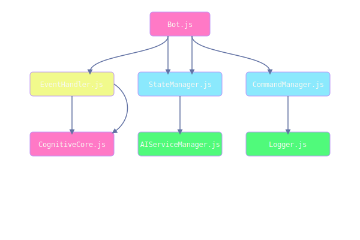

<p align="center">
  
</p>

<h1 align="center">Prometheus - Kerangka Genom Sibernetik</h1>

<p align="center">
  <i>"Entitas digital yang kepribadian dan perilakunya didefinisikan oleh sebuah genom eksternal, ditulis dalam Cognitive Markup Language."</i>
</p>

<p align="center">
  <a href="DOCS/THEORY.md"></a>
  <a href="DOCS/CML_REFERENCE.md"></a>
  <a href="#"></a>
  <a href="#"></a>
</p>

---

**Prometheus** adalah implementasi pertama dari **Kerangka Genom Sibernetik**, sebuah arsitektur orisinal di mana perilaku entitas tidak hanya muncul dari kode, tetapi didefinisikan oleh sebuah "genom" eksternal yang ditulis dalam **Cognitive Markup Language (`.cml`)**. Ini memungkinkan pemisahan total antara logika inti (raga) dan kepribadian (jiwa), membuka kemungkinan untuk evolusi perilaku yang dinamis.

Untuk pemahaman yang mendalam, silakan baca dokumentasi khusus kami:
* **[📜 Teori & Konsep Genom Sibernetik](DOCS/THEORY.md)**
* **[🌐 Arsitektur & Anatomi Entitas](DOCS/ARCHITECTURE.md)**
* **[🧬 Referensi Bahasa `.cml`](DOCS/CML_REFERENCE.md)**

---

### 🖥️ **Demonstrasi Pusat Komando (CLI Live)**

CLI menyediakan akses langsung ke sistem saraf entitas. Gambar SVG di bawah ini adalah simulasi sesi terminal yang dirender secara presisi.

<p align="center">
  
</p>

> Untuk daftar perintah lengkap, baca **[Referensi Lengkap CLI](DOCS/CLI_REFERENCE.md)**.

---

### 🧠 **Visualisasi Metrik & Peta Otak**

Metrik kode dan struktur dependensi divisualisasikan secara dinamis melalui GitHub Actions.

* **Komposisi Bahasa & Ukuran Kode:**
    
    
* **Peta Otak (Dependensi Modul):**
    <p align="center">
      
    </p>

---

### 🎮 Prometheus Run: Sebuah Mini-Game Interaktif

Permainan ini hidup dan terhubung dengan kondisi entitas Prometheus. Aksi Anda di bawah ini akan mengubah state permainan.

<p align="center">
  " alt="Prometheus Run Game Screen"/>
</p>

<p align="center">
  <a href="https://prometheus-game.vercel.app/api/action?user=razzaqinspires&move=jump">
    
  </a>
  <a href="https://prometheus-game.vercel.app/api/action?user=razzaqinspires&move=duck">
    
  </a>
</p>

### 🚀 **Instalasi & Deployment**

<details>
<summary><strong>Klik untuk melihat instruksi instalasi, konfigurasi, dan deployment</strong></summary>

#### **Prasyarat**
* [Node.js](https://nodejs.org/) v18+
* [FFmpeg](https://ffmpeg.org/download.html)
* [Git](https://git-scm.com/downloads)

#### **Langkah-langkah Instalasi**
1.  **Kloning & Instal**: `git clone https://github.com/razzaqinspires/prometheus-wa-bot.git`, `cd prometheus-wa-bot`, `npm install`.
2.  **Konfigurasi Environment**: Salin `.env.example` menjadi `.env` (`cp .env.example .env`), lalu isi semua API key dan nomor owner Anda.
3.  **Konfigurasi Genom**: Buka `persona.cml` untuk menyesuaikan prinsip inti dan refleks bot.

#### **Menjalankan Bot**
```bash
npm start
```
Ikuti proses login (QR atau Pairing Code) saat pertama kali dijalankan.

#### **Deployment Cepat**
Gunakan salah satu tombol di bawah ini untuk men-deploy salinan Prometheus Anda.
[](https://heroku.com/deploy?template=https://github.com/NAMA_ANDA/GANTI-REPO)
[](https://railway.app/new/template?template=https://github.com/NAMA_ANDA/GANTI-REPO)

</details>

---
### ❤️ **Dukung Proyek**

[](https://saweria.co/arzzq)

**Target Saat Ini: Implementasi Parser `.cml` Internal (V6.0)**
* **Dana Terkumpul: Rp 0 / Rp 1.000.000**
    

---
### 📜 **Lisensi & Kepemilikan Teori**

Kode sumber dilisensikan di bawah **Lisensi ISC**.

Teori **Arsitektur Singularitas Sibernetik (CSA)**, **Kerangka Genom Sibernetik**, dan bahasa **Cognitive Markup Language (`.cml`)** adalah kekayaan intelektual orisinal dari proyek ini. Penggunaan atau adaptasi teori ini harus menyertakan atribusi yang jelas ke repositori ini.